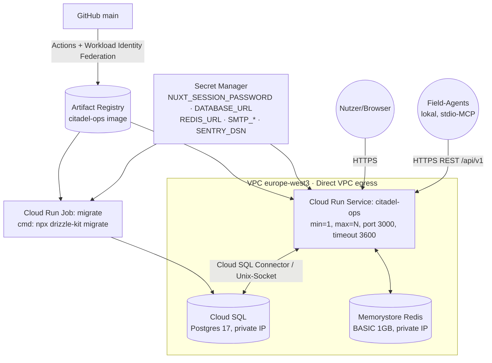

# Citadel Ops — Deployment auf Google Cloud (Plan)

**Status:** Planungsdokument · **Ziel:** Cloud Run in `europe-west3` (Frankfurt) · **IaC:** Terraform
**Scope dieser Datei:** _nur Plan/Doku_ — kein anwendbarer Code, keine App-Änderung. Sie beschreibt
die Zielarchitektur, das Terraform-Layout, die Secrets-/Migrations-/CD-Verdrahtung, das Tuning, eine
Kostenschätzung und eine abarbeitbare Checkliste. Umsetzung erfolgt separat (Branch/Operation).

Verwandte Specs: [OPERATION-HORIZON](../files/OPERATION-HORIZON-spec.md) (Multi-Instanz), [RUNNER.md](../RUNNER.md) (Cloud-Run-Hinweise §M9).

---

## 0. Ausgangslage — was der Code schon mitbringt

Die anwendungsseitige Härtung (Operation HORIZON) ist **umgesetzt und getestet**. Für den Deploy
fehlt reines Plumbing, kein Umbau am App-Code.

| HORIZON-Mission                                   | Zustand   | Beleg                                                                                                                                    |
| ------------------------------------------------- | --------- | ---------------------------------------------------------------------------------------------------------------------------------------- |
| M1 Redis-Backplane                                | ✅ gebaut | `server/utils/redis.ts`, `REDIS_URL` in `00.env-check.ts`                                                                                |
| M2 Event-Bus cross-instance (SSE/Webhook-Fan-out) | ✅ gebaut | `server/utils/events.ts` (Redis Pub/Sub, Channel `citadel:events`, Origin-Tag gegen Doppelzustellung)                                    |
| M3 The-Wire Append serialisiert                   | ✅ gebaut | `server/utils/activity.ts` → `pg_advisory_xact_lock(hashtext(projectId))` in Transaktion, geordnet über `seq`                            |
| M4 Rate-Limit + Login-Throttle verteilt           | ✅ gebaut | `server/utils/ratelimit.ts` (Redis `INCR`/`EXPIRE`)                                                                                      |
| M7 DB-Pool konfigurierbar                         | ✅ gebaut | `server/db/index.ts` → `DB_POOL_MAX`                                                                                                     |
| M8 Migration vom Boot entkoppelt                  | ✅ gebaut | `docker-entrypoint.sh` → `RUN_MIGRATIONS=0`                                                                                              |
| M10 Konkurrenztest (≥2 Instanzen)                 | ✅ gebaut | `test/integration/horizon.test.ts`, `test/integration/wire.test.ts`                                                                      |
| Prod-Env-Guard (fail-fast)                        | ✅ gebaut | `server/plugins/00.env-check.ts` (Session-PW ≥32, `DATABASE_URL`, `REDIS_URL`)                                                           |
| Health/Metrics/Sentry/Pino                        | ✅ gebaut | `server/routes/health.get.ts` (503 bei degraded), `/metrics`, `server/plugins/01.sentry.ts`, `server/utils/logger.ts` (Secret-Redaction) |

**Sonstiges (vom Code bestätigt):** Nitro-Preset `node-server` (`.output/nitro.json`) — hört auf
`PORT` (Cloud-Run-kompatibel). MCP läuft als **stdio-CLI**, _kein_ HTTP-Endpoint → nichts zusätzlich
zu exponieren. `.env` ist **nicht** eingecheckt. Der App-Server ist **zustandslos** (keine lokalen
Dateizugriffe; `worktreePath` ist nur eine DB-Spalte für den — deferten — Remote-Runner).

**Offen für GCP (dieses Dokument):**

- **M9** Cloud-Run-Konfiguration + die gesamte Managed-Infra (Cloud SQL, Memorystore, VPC, Secrets, Artifact Registry) — existiert nur als Prosa, nicht als IaC.
- **CD** — CI testet nur (`.github/workflows/ci.yml`); baut/pusht **kein** Image und deployt nicht.
- **DB-TLS** — `server/db/index.ts` setzt keine SSL-Option; wird über den **Cloud-SQL-Connector (Unix-Socket)** gelöst → kein Code-Change nötig (siehe §5).
- **Graceful Shutdown** — kein expliziter SIGTERM-Drain-Hook; für Cloud Run empfohlen (siehe §7, kein Blocker).
- **M5** Durable Webhooks (Cloud Tasks) — optional, erst wenn ein bei Neustart verlorener Webhook wehtut.

---

## 1. Zielarchitektur



**Kernentscheidungen**

- **Cloud Run (v2)** statt GKE — der Server ist zustandslos; Autoscaling + Scale-to-min passt.
  `min-instances=1` hält eine warme Instanz für SSE.
- **Cloud SQL for PostgreSQL 17**, **private IP**, Zugriff via **Cloud-SQL-Connector (Unix-Socket)** —
  löst zugleich das fehlende DB-TLS (Socket statt TLS).
- **Memorystore for Redis (BASIC, 1 GB)**, private IP — Pflicht in Prod (`00.env-check.ts`).
- **Direct VPC egress** (GA) statt Serverless-VPC-Connector → günstiger, kein Connector-Instanzpaar.
- **Migrations als separater Cloud Run Job** (gleiches Image, Command überschrieben) — App-Service
  startet mit `RUN_MIGRATIONS=0`.
- **Secret Manager** für alle Geheimnisse, als Env in Service _und_ Job gemountet.
- **CD über GitHub Actions + Workload Identity Federation** (keine langlebigen SA-Keys).

---

## 2. Voraussetzungen

- GCP-Projekt (z. B. `citadel-ops-prod`) mit aktivem Billing.
- Region **`europe-west3`** (Datenresidenz DE, vgl. Plan §26).
- Zu aktivierende APIs: `run`, `sqladmin`, `redis`, `vpcaccess`, `servicenetworking`,
  `secretmanager`, `artifactregistry`, `cloudbuild` (optional), `iamcredentials` (für WIF).
- Terraform ≥ 1.7, `google` Provider ≥ 5.x.
- Remote-State-Bucket (GCS) für Terraform.

---

## 3. Terraform-Layout

Vorgeschlagene Struktur unter `deploy/terraform/` (in dieser Doku beschrieben, noch nicht angelegt):

```
deploy/terraform/
  versions.tf         # provider google/google-beta, required_version, GCS backend
  variables.tf        # project_id, region, db_tier, redis_size_gb, image, min/max_instances …
  apis.tf             # google_project_service (alle APIs oben)
  network.tf          # VPC, Subnetz, private-services-access (PSA) für SQL+Redis
  db.tf               # Cloud SQL Instance + DB + User
  redis.tf            # Memorystore Instance
  registry.tf         # Artifact Registry (docker)
  secrets.tf          # Secret Manager Secrets + Versionen
  iam.tf              # Runtime-SA + Rollen; WIF-Pool/Provider + Deployer-SA
  run_service.tf      # google_cloud_run_v2_service (App)
  run_job.tf          # google_cloud_run_v2_job (migrate)
  outputs.tf          # service_url, sql_connection_name, redis_host …
  envs/prod.tfvars    # konkrete Werte
```

### 3.1 Netzwerk, DB, Redis (repräsentativ)

```hcl
# network.tf — private Konnektivität für Cloud SQL + Memorystore
resource "google_compute_network" "vpc" {
  name                    = "citadel-vpc"
  auto_create_subnetworks = false
}
resource "google_compute_subnetwork" "subnet" {
  name          = "citadel-subnet"
  ip_cidr_range = "10.20.0.0/24"
  region        = var.region
  network       = google_compute_network.vpc.id
}
# Private Service Access (nötig für Cloud SQL + Memorystore private IP)
resource "google_compute_global_address" "psa_range" {
  name          = "citadel-psa"
  purpose       = "VPC_PEERING"
  address_type  = "INTERNAL"
  prefix_length = 16
  network       = google_compute_network.vpc.id
}
resource "google_service_networking_connection" "psa" {
  network                 = google_compute_network.vpc.id
  service                 = "servicenetworking.googleapis.com"
  reserved_peering_ranges = [google_compute_global_address.psa_range.name]
}
```

```hcl
# db.tf — Cloud SQL Postgres 17, private IP
resource "google_sql_database_instance" "pg" {
  name             = "citadel-pg"
  region           = var.region
  database_version = "POSTGRES_17"
  depends_on       = [google_service_networking_connection.psa]
  settings {
    tier              = var.db_tier            # z.B. "db-custom-1-3840"
    availability_type = "ZONAL"                # "REGIONAL" für HA (teurer)
    disk_autoresize   = true
    ip_configuration {
      ipv4_enabled    = false                  # nur privat
      private_network = google_compute_network.vpc.id
    }
    backup_configuration { enabled = true, point_in_time_recovery_enabled = true }
    database_flags { name = "max_connections", value = "100" }
  }
  deletion_protection = true
}
resource "google_sql_database" "citadel" { name = "citadel", instance = google_sql_database_instance.pg.name }
resource "google_sql_user" "citadel"     { name = "citadel", instance = google_sql_database_instance.pg.name, password = var.db_password }
```

```hcl
# redis.tf — Memorystore BASIC 1GB, private IP im selben VPC
resource "google_redis_instance" "redis" {
  name               = "citadel-redis"
  tier               = "BASIC"          # "STANDARD_HA" für Failover
  memory_size_gb     = var.redis_size_gb  # 1
  region             = var.region
  authorized_network = google_compute_network.vpc.id
  connect_mode       = "PRIVATE_SERVICE_ACCESS"
  redis_version      = "REDIS_7_0"
}
```

### 3.2 Secrets + IAM (repräsentativ)

```hcl
# secrets.tf — je Secret ein Eintrag; Werte via tfvars/CLI, NICHT im State-Klartext dokumentieren
locals { secret_ids = ["NUXT_SESSION_PASSWORD", "DATABASE_URL", "REDIS_URL", "SENTRY_DSN", "SMTP_PASS"] }
resource "google_secret_manager_secret" "s" {
  for_each  = toset(local.secret_ids)
  secret_id = each.value
  replication { user_managed { replicas { location = var.region } } }  # EU-Residenz
}
# Versionen werden separat/out-of-band gesetzt (gcloud secrets versions add) — nicht im TF-State.
```

```hcl
# iam.tf — Runtime-Service-Account des Cloud-Run-Service
resource "google_service_account" "run" { account_id = "citadel-run" }
resource "google_project_iam_member" "run_sql"    { project = var.project_id, role = "roles/cloudsql.client",           member = "serviceAccount:${google_service_account.run.email}" }
resource "google_project_iam_member" "run_secret" { project = var.project_id, role = "roles/secretmanager.secretAccessor", member = "serviceAccount:${google_service_account.run.email}" }
# + Workload Identity Federation Pool/Provider für GitHub Actions (Deployer-SA mit run.admin, artifactregistry.writer, run.invoker-Setzung)
```

### 3.3 Cloud Run Service + Migrate-Job (repräsentativ)

```hcl
# run_service.tf — App
resource "google_cloud_run_v2_service" "app" {
  name     = "citadel-ops"
  location = var.region
  template {
    service_account = google_service_account.run.email
    scaling { min_instance_count = 1, max_instance_count = var.max_instances }
    timeout = "3600s"                              # SSE-Langläufer (§M9)
    vpc_access {
      network_interfaces { network = google_compute_network.vpc.id, subnetwork = google_compute_subnetwork.subnet.id }
      egress = "PRIVATE_RANGES_ONLY"               # Direct VPC egress → SQL/Redis privat
    }
    volumes { cloud_sql_instance { instances = [google_sql_database_instance.pg.connection_name] } }
    containers {
      image = var.image                            # europe-west3-docker.pkg.dev/…/citadel-ops:<sha>
      ports { container_port = 3000 }
      volume_mounts { name = "cloudsql", mount_path = "/cloudsql" }
      env { name = "NODE_ENV",            value = "production" }
      env { name = "RUN_MIGRATIONS",      value = "0" }                       # Migration macht der Job
      env { name = "DB_POOL_MAX",         value = "10" }                      # max_instances × 10 ≤ 100 − Reserve
      env { name = "NUXT_PUBLIC_APP_URL", value = var.app_url }
      env { name = "REDIS_URL",           value = "redis://${google_redis_instance.redis.host}:6379" }
      # Secrets als Env aus Secret Manager:
      env { name = "NUXT_SESSION_PASSWORD" value_source { secret_key_ref { secret = "NUXT_SESSION_PASSWORD", version = "latest" } } }
      env { name = "DATABASE_URL"          value_source { secret_key_ref { secret = "DATABASE_URL", version = "latest" } } }
      startup_probe  { http_get { path = "/health" }, initial_delay_seconds = 10, timeout_seconds = 3, failure_threshold = 6 }
      liveness_probe { http_get { path = "/health" }, period_seconds = 30 }
      resources { limits = { cpu = "1", memory = "1Gi" }, cpu_idle = false }  # cpu_idle=false: CPU auch außerhalb Requests (SSE)
    }
  }
}
```

`DATABASE_URL` nutzt den Unix-Socket des Connectors (kein TLS nötig, §5):

```
postgres://citadel:<pw>@/citadel?host=/cloudsql/<PROJECT>:<REGION>:citadel-pg
```

```hcl
# run_job.tf — Migration (gleiches Image, Command überschrieben)
resource "google_cloud_run_v2_job" "migrate" {
  name     = "citadel-migrate"
  location = var.region
  template { template {
    service_account = google_service_account.run.email
    vpc_access { network_interfaces { network = google_compute_network.vpc.id, subnetwork = google_compute_subnetwork.subnet.id }, egress = "PRIVATE_RANGES_ONLY" }
    volumes { cloud_sql_instance { instances = [google_sql_database_instance.pg.connection_name] } }
    containers {
      image   = var.image
      command = ["npx"], args = ["drizzle-kit", "migrate"]
      volume_mounts { name = "cloudsql", mount_path = "/cloudsql" }
      env { name = "DATABASE_URL" value_source { secret_key_ref { secret = "DATABASE_URL", version = "latest" } } }
    }
  } }
}
```

> Damit `drizzle-kit migrate` im Container läuft, müssen `drizzle-kit` + Config im Image liegen — das
> aktuelle Dockerfile behält bewusst alle Deps, passt also. (Alternative bei schlankerem Runtime-Image:
> ein separates „migrate"-Stage/Image. Siehe §7.)

---

## 4. CD-Pipeline (GitHub Actions, ohne SA-Keys)

Neue Workflow-Datei `.github/workflows/deploy.yml`, ausgelöst auf `main` nach grünem CI:

1. **Auth** via Workload Identity Federation (`google-github-actions/auth`, `permissions: id-token: write`).
2. **Build & Push:** `docker build` → `docker push europe-west3-docker.pkg.dev/$PROJECT/citadel/citadel-ops:${{ github.sha }}`.
3. **Migrate:** `gcloud run jobs update citadel-migrate --image …:$SHA` → `gcloud run jobs execute citadel-migrate --wait`.
4. **Deploy:** `gcloud run deploy citadel-ops --image …:$SHA` (oder `terraform apply` mit `-var image=…:$SHA`).
5. **Smoke:** `curl -f $SERVICE_URL/health` erwartet `200 {"status":"ok"}`.

Reihenfolge **Migrate → Deploy** ist wichtig (Expand-Contract: additive Migrationen zuerst, dann neuer Code).

---

## 5. Konfig-Feinheiten (aus dem Code abgeleitet)

- **DB-TLS gelöst durch den Connector:** Unix-Socket `/cloudsql/<conn>` → keine `ssl`-Option in
  `server/db/index.ts` nötig. Alternative (private IP direkt) bräuchte `?sslmode=require` im
  Connection-String — dann kein Code-Change, nur String.
- **DB-Pool-Formel (§M7):** `max_instances × DB_POOL_MAX ≤ max_connections − Reserve`. Bei
  `max_connections=100` und `DB_POOL_MAX=10` → max. ~8 Instanzen. Für mehr: `DB_POOL_MAX` senken
  oder PgBouncer/Connector-Pooling.
- **SSE + Concurrency (§M9):** jeder `/api/v1/events`-Client belegt einen Request-Slot dauerhaft.
  Bei `concurrency=80` → ≤80 Dauerverbindungen/Instanz, danach skaliert Cloud Run auf _Verbindungen_
  statt CPU. Bei vielen Dashboards die SSE-Route als eigenen High-Concurrency-Service abspalten.
- **`min-instances=1`** für warme SSE (sonst Verbindungsabriss bei Scale-to-zero).
- **`timeout=3600`** wegen SSE-Langläufern.
- **`cpu_idle=false`** (CPU always-on), damit der Redis-Subscriber/Bus auch ohne aktiven Request läuft.
- **`/metrics`** mit `METRICS_TOKEN` schützen (sonst offen). Scrapen via Cloud Monitoring/Prometheus.
- **`NUXT_PUBLIC_APP_URL`** = öffentliche Service-URL (Invite-/Reset-Mail-Links).

---

## 6. Kostenschätzung (grob, europe-west3, Listenpreise, EUR/Monat)

> Richtwerte für eine **kleine Prod-Instanz** (1–2 Cloud-Run-Instanzen). Tatsächliche Kosten
> variieren mit Traffic, Tier und Rabatten — vor dem Go-live mit dem GCP-Preisrechner prüfen.

| Komponente             | Annahme                                    | ~ €/Monat    |
| ---------------------- | ------------------------------------------ | ------------ |
| Cloud Run (App)        | min=1, 1 vCPU / 1 GiB, CPU always-on       | 35–55        |
| Cloud SQL Postgres     | `db-custom-1-3840`, ZONAL, 10 GB + Backups | 45–70        |
| Memorystore Redis      | BASIC, 1 GB                                | 35–45        |
| Direct VPC egress      | (kein Connector-Instanzpaar)               | ~0           |
| Artifact Registry      | wenige GB Images                           | 1–3          |
| Secret Manager         | ~6 Secrets + Zugriffe                      | <1           |
| Cloud Build / Netzwerk | gelegentliche Builds, geringer Egress      | 1–5          |
| **Summe**              |                                            | **~120–180** |

**Sparhebel:** ZONAL statt REGIONAL bei DB (kein HA), Redis BASIC statt STANDARD_HA, `cpu_idle=true`
falls SSE nicht dauerhaft gebraucht wird (dann aber `min=1` genügt nicht für warme Streams). **HA-Ausbau**
(REGIONAL-DB, STANDARD_HA-Redis) verdoppelt grob den DB/Redis-Anteil.

---

## 7. Vor dem Go-live prüfen (kein Blocker, empfohlen)

- **Graceful Shutdown:** Cloud Run sendet `SIGTERM` vor dem Stopp. Prüfen, dass der Node-Server
  in-flight Requests sauber drainen und den Redis-Sub schließen kann; ggf. einen Nitro-`close`-Hook
  ergänzen. Ohne das droht bei Scale-in ein abrupter SSE-Abriss (Clients reconnecten aber).
- **Dockerfile schlanker (optional):** aktuell single-stage mit devDeps (`drizzle-kit`/`tsx`) im
  Runtime-Image — läuft, ist aber fett. Optional multi-stage + eigenes Migrate-Image. Kein Blocker.
- **Cookie-Flags:** `nuxt-auth-utils` setzt `secure` in Prod automatisch (hinter HTTPS/Cloud Run) —
  einmal verifizieren (`Set-Cookie` mit `Secure; HttpOnly; SameSite`).
- **Seed nie in Prod:** `SEED_ON_START` weglassen; `CITADEL_ALLOW_SEED` nicht setzen (Prod-Guard greift ohnehin).
- **M5 Durable Webhooks:** erst bauen, wenn ein bei Neustart verlorener Webhook real wehtut (Cloud Tasks).
- **Backups/Restore einmal testen** (PITR ist an, aber ungetestetes Backup = kein Backup).

---

## 8. Checkliste (Reihenfolge)

1. [ ] GCP-Projekt + Billing + APIs aktivieren; GCS-Bucket für Terraform-State.
2. [ ] `deploy/terraform/` gemäß §3 anlegen; `envs/prod.tfvars` befüllen.
3. [ ] **Secrets** out-of-band setzen: `NUXT_SESSION_PASSWORD` (`openssl rand -hex 32`), `DATABASE_URL`
       (Socket-Form, §5), `REDIS_URL`, optional `SMTP_*`/`SENTRY_DSN` → `gcloud secrets versions add`.
4. [ ] `terraform apply` **ohne** Cloud-Run-Ressourcen zuerst: VPC/PSA → Cloud SQL → Memorystore → Registry → Secrets → IAM.
5. [ ] Erstes Image bauen + nach Artifact Registry pushen.
6. [ ] `terraform apply` für **Migrate-Job** + **App-Service**.
7. [ ] Migrate-Job **einmal ausführen** (`gcloud run jobs execute citadel-migrate --wait`).
8. [ ] Erst-Setup der Super-Admin/Org: entweder Seed-Job einmalig mit `CITADEL_ALLOW_SEED=true`
       _(bewusst, danach entfernen)_ oder manuell über die App.
9. [ ] `GET $SERVICE_URL/health` → `200 {"status":"ok","checks":{"db":"ok","redis":"ok"}}`.
10. [ ] WIF + `.github/workflows/deploy.yml` (§4) einrichten; ersten CD-Lauf grün.
11. [ ] Rauchtest: Login, Board, SSE-Live-Update (zwei Browser), eine Mission end-to-end.
12. [ ] `/metrics` + Cloud-Monitoring-Alerts (Error-Rate, p95, `/health`-Failures) verdrahten.

**Definition of Done:** Frischer Deploy migriert genau einmal (Job, nicht Boot); App-Instanzen starten
ohne Schema-Arbeit; `/health` grün inkl. Redis; SSE-Update erreicht einen Client auf einer _anderen_
Instanz; CD deployt auf Merge nach `main` mit Migrate-vor-Deploy.

---

## 9. Einspeisung als Citadel-Operation (optional)

Dieses Dokument ist Planner-tauglich. Objective-Einzeiler für eine Operation „LANDFALL":

> Deploye Citadel Ops nach Google Cloud (Cloud Run, `europe-west3`): Terraform-Modul (VPC/PSA,
> Cloud SQL 17 privat, Memorystore, Artifact Registry, Secret Manager, IAM/WIF), Migrate-Job + App-Service
> (§3), CD-Workflow (§4). Abschluss über die Checkliste §8; DoD wie oben.

Missions-Schnitt (Sektoren INFRA/BACKEND/QA): (1) Netzwerk+PSA, (2) Cloud SQL, (3) Memorystore,
(4) Registry+Secrets+IAM/WIF, (5) Migrate-Job+App-Service, (6) CD-Workflow, (7) Go-live-Rauchtest (QA-Gate).
Reihenfolge = Checkliste §8.
